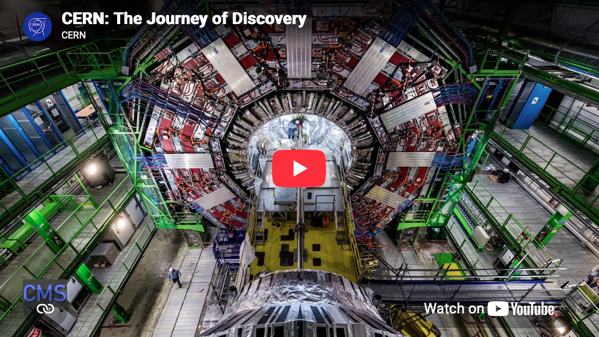

## Everyone Can Reason Quantitatively

Introduction for Everyone Can Reason Quantitatively goes here.

### SubSection

Introduction for subsection - see @knuth84 for more details.

::: {#fig-skateboard}
]{fig-alt="Alt Text"}

Caption Text: is this numbered?
:::

I can link to a subsequent figure in another chapter here: @fig-skateboard2.

#### SubSubSection

Introduction for subsubsection.[^1] and another.[^longnote]

[^1]: Here is the footnote.

[^longnote]: Here's one with multiple blocks.

    Subsequent paragraphs are indented to show that they
belong to the previous footnote.

        { some.code }
    The whole paragraph can be indented, or just the first
    line.  In this way, multi-paragraph footnotes work like
    multi-paragraph list items.

This paragraph won't be part of the note, because it
isn't indented.

```{python}
#| label: fig-matplot
#| fig-cap: "A simple sine wave chart."

import numpy as np
import matplotlib.pyplot as plt

x = np.linspace(0, 10, 100)
y = np.sin(x)

plt.figure(figsize=(8, 4))
plt.plot(x, y, color="skyblue", linewidth=2)
plt.title("Sine Wave")
plt.grid(True)
plt.show()
```

| Right | Left | Default | Center |
|------:|:-----|---------|:------:|
|   12  |  12  |    12   |    12  |
|  123  |  123 |   123   |   123  |
|    1  |    1 |     1   |     1  |

: Varied Dimensions {.striped .hover}

:::{.callout-note}
Note that there are five types of callouts, including: 
`note`, `tip`, `warning`, `caution`, and `important`.
:::

> Blockquote 

::: {#fig-cern}

::: {.content-visible when-format="html"}

:::

::: {.content-visible when-format="typst"}
{fig-alt="CERN image"}
:::

What is CERN? *Interactive version available at: [https://youtu.be/wo9vZccmqwc](https://youtu.be/wo9vZccmqwc)*
:::

### Exercises

::: {#exr-numbers-everyone-1}
Do you know?

::: {.callout-note collapse="true" title="Hint"}
This is a hint.
:::

::: {.callout-tip collapse="true" title="Answer"}
$$x = \frac{-b \pm \sqrt{b^2 - 4ac}}{2a}$$
:::
:::

### Homework Problems

::: {#exr-hw-1-1}
## Problem 1
Solve the initial value problem:
$$ \frac{dy}{dx} = 3x^2 + 2x, \quad y(0) = 5 $$
:::

::: {.content-visible when-profile="teacher"}
::: {.callout-tip title="Solution & Marking Scheme" collapse="false"}
**Solution:**
Integrate both sides:
$$ y(x) = x^3 + x^2 + C $$

Apply initial condition $y(0) = 5$:
$$ 5 = 0^3 + 0^2 + C \implies C = 5 $$

**Final Answer:** $y(x) = x^3 + x^2 + 5$

* **Grading Note:** Award 1 point for integration, 1 point for applying initial condition correctly.
:::
:::

```{=html}
<!-- Floating GeoGebra Calculator -->
<button id="ggb-toggle" style="position: fixed; bottom: 20px; right: 20px; z-index: 10000; padding: 10px 15px; background-color: #007bc2; color: white; border: none; border-radius: 5px; cursor: pointer; box-shadow: 0 4px 6px rgba(0,0,0,0.2); font-weight: bold;">
  🧮 Toggle Calculator
</button>

<div id="ggb-container" style="display: none; position: fixed; bottom: 70px; right: 20px; z-index: 9999; box-shadow: 0px 10px 30px rgba(0,0,0,0.3); border-radius: 8px; overflow: hidden; background: white; border: 1px solid #ccc;">
  <div id="ggb-element"></div>
</div>

<!-- Updated official CDN link -->
<script src="https://cdn.geogebra.org/apps/deployggb.js"></script>

<script>
  let isAppletInjected = false;

  const toggleBtn = document.getElementById('ggb-toggle');
  const container = document.getElementById('ggb-container');

  toggleBtn.addEventListener('click', function() {
    // 1. Toggle visibility
    if (container.style.display === 'none' || container.style.display === '') {
      container.style.display = 'block';

      // 2. Inject GeoGebra ONLY after the container is visible
      if (!isAppletInjected) {
        var parameters = {
          "appName": "graphing",
          "width": 400,
          "height": 500,
          "showToolBar": true,
          "showAlgebraInput": true,
          "showMenuBar": false,
          "enableRightClick": false,
          "enableShiftDragZoom": true
        };
        
        var applet = new GGBApplet(parameters, true);
        applet.inject('ggb-element');
        isAppletInjected = true;
      }
    } else {
      container.style.display = 'none';
    }
  });
</script>